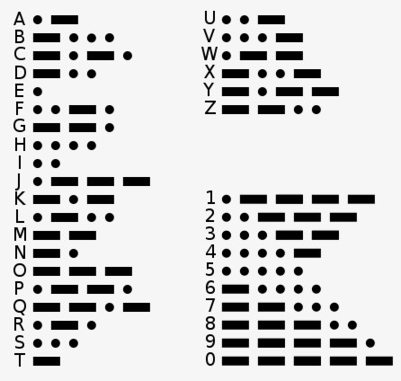
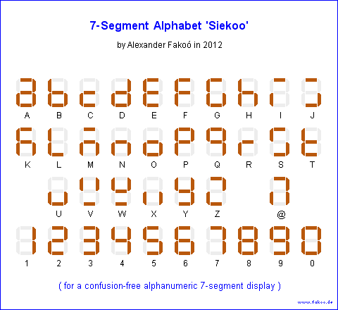
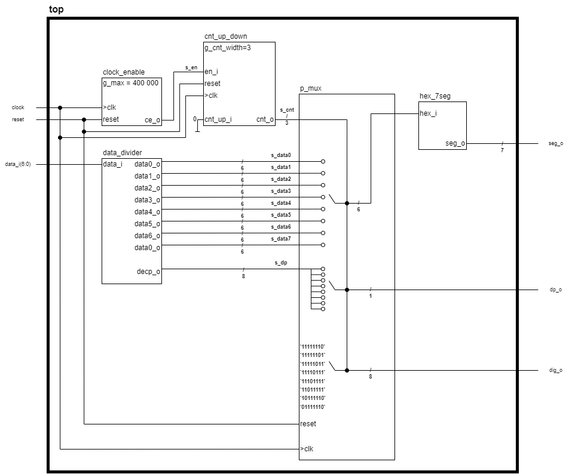
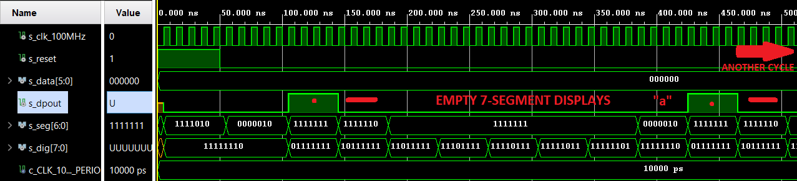
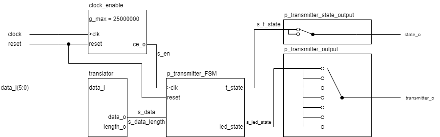
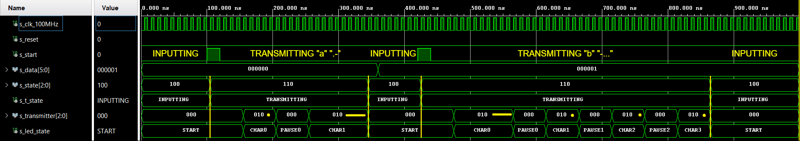
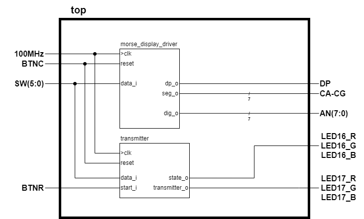
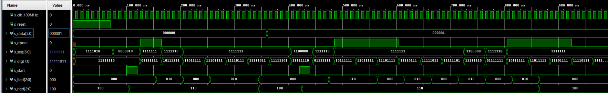

# MORSE CODE TRANSMITTER

### Team members

* Jan Pelka (responsible for VHDL [transmitter module](#transmitter))
* Jakub Tauber (responsible for VHDL programing and video making)
* Anton Tsyhanov (responsible for design)
* David Hamran (responsible for VHDL [display driver module](#disp_driver) and github)  
### Table of contents

* [Project objectives](#objectives)
* [Hardware description](#hardware)
* [VHDL modules description and simulations](#modules)
* [TOP module description and simulations](#top)
* [Video](#video)
* [References](#references)

## Project objectives

Objective of our project is to create a Morse code transmitter. Our approach is that user will select desired character from alphabet that will be displayed on NEXYS A7-50T 7-segment displays. Transmitter will be in state of inputting, in this state a red LED shining. After selecting desired character, user can trasmit by pressing a button. After the press of a button state will be changed to transmitting which will be indicated by LEDs color changing to yellow. From this state transmitter will go back to inputting state and process can be repeated.

### State diagram:

### Alphabet represented in binary

| **Character** | **Binary** | **Character** | **Binary** | **Character** | **Binary** |
   | :-: | :-: | :-: | :-: | :-: | :-: |
   | A | 000 000 | J | 001 001 | S | 010 010 |
   | B | 000 001 | K | 001 010 | T | 010 011 |
   | C | 000 010 | L | 001 011 | U | 010 100 |
   | D | 000 011 | M | 001 100 | V | 010 101 |
   | E | 000 100 | N | 001 101 | W | 010 110 |
   | F | 000 101 | O | 001 110 | X | 010 111 |
   | G | 000 110 | P | 001 111 | Y | 011 000 |
   | H | 000 111 | Q | 010 000 | Z | 011 001 |
   | I | 001 000 | R | 010 001 | @ | 100 100 |
   
### Numbers represented in binary

| **Character** | **Binary** | **Character** | **Binary** |
   | :-: | :-: | :-: | :-: |
   | 0 | 011 010 | 5 | 011 111 |
   | 1 | 011 011 | 6 | 100 000 |
   | 2 | 011 100 | 7 | 100 001 |
   | 3 | 011 101 | 8 | 100 010 |
   | 4 | 011 110 | 9 | 100 011 |
  
### Morse alphabet

  
In addition @ symbol is represented as **.--.-.**
    

### 7-seg alphabet implementation

To display whole alphabet on 7-seg display we use 7-segment alphabet 'Seikoo' by Alexander Fakoó

Link: 
[7-segment alphabet 'Seikoo' by Alexander Fakoó in 2012](https://fakoo.de/)

# Hardware description

# VHDL modules description and simulations

### List of modules

* [display driver](https://github.com/MusicalTester63/digital-electronics-1/blob/main/project/vivado/morse_display_driver/morse_display_driver.srcs/sources_1/new/driver_7seg_8digits.vhd)
* [transmitter](https://github.com/MusicalTester63/digital-electronics-1/blob/main/project/vivado/transmitter/transmitter.srcs/sources_1/new/transmitter.vhd)

### List of components

* [data divider](https://github.com/MusicalTester63/digital-electronics-1/blob/main/project/vivado/morse_display_driver/morse_display_driver.srcs/sources_1/new/data_divider.vhd)
* [translator](https://github.com/MusicalTester63/digital-electronics-1/blob/main/project/vivado/transmitter/transmitter.srcs/sources_1/new/translator.vhd)
* [clock enable](https://github.com/MusicalTester63/digital-electronics-1/blob/main/project/vivado/morse_display_driver/morse_display_driver.srcs/sources_1/new/clock_enable.vhd)
* [counter up down](https://github.com/MusicalTester63/digital-electronics-1/blob/main/project/vivado/morse_display_driver/morse_display_driver.srcs/sources_1/new/cnt_up_down.vhd)
* [hex 7 seg](https://github.com/MusicalTester63/digital-electronics-1/blob/main/project/vivado/morse_display_driver/morse_display_driver.srcs/sources_1/new/hex_7seg.vhd)

## Morse display driver
This component is inspired by: [display driver](https://github.com/tomas-fryza/digital-electronics-1/tree/master/labs/07-display_driver)
First six 7-segment displays are used to display morse code. Last display is used to display normal character or number.

### Block scheme of the driver

### Simulation
This example shows how driver displays character "a" and also demonstrates reset function.

## Morse code transmitter
This component uses RGB LEDs. Left LED is used to transmit morse code by blinking(DOT) and shining(DASH). Left LED either blinks or shines in green color or it is turned off completely. Right LED is used as state indicator. When red light is shining, transmitter is in the state of inputting. When a button is pressed, transmitters state changes to transmitting which is indicated by yellow light. After transmitting it returns to inputting state indicated by red as mentioned before.

### Block scheme of the transmitter

### Simulation
This example shows how transmitter translates and transmits character "a" and "b"

# TOP module description and simulations

### List of modules

* [display driver](https://github.com/MusicalTester63/digital-electronics-1/blob/main/project/vivado/morse_display_driver/morse_display_driver.srcs/sources_1/new/driver_7seg_8digits.vhd)
* [transmitter](https://github.com/MusicalTester63/digital-electronics-1/blob/main/project/vivado/transmitter/transmitter.srcs/sources_1/new/transmitter.vhd)

### Description
TOP module combines function of display [driver](#disp_driver) and [transmitter](#transmitter)
with a use of NEXYS A7-50T boards componets such as buttons,switches, LEDs and 7-segment displays.  
  
Link to bitstream: [MCT bitstream](https://github.com/MusicalTester63/digital-electronics-1/blob/main/project/vivado/mct.bit)

### Block scheme of the top

### Simulation
This example shows how transmitter displays,translates and transmits character "a" and "b", also shows reset function.

# Video

In making.

# References

1.	[7-segment alphabet 'Seikoo' by Alexander Fakoó in 2012](https://fakoo.de/)
2.	[display driver](https://github.com/tomas-fryza/digital-electronics-1/tree/master/labs/07-display_driver)
