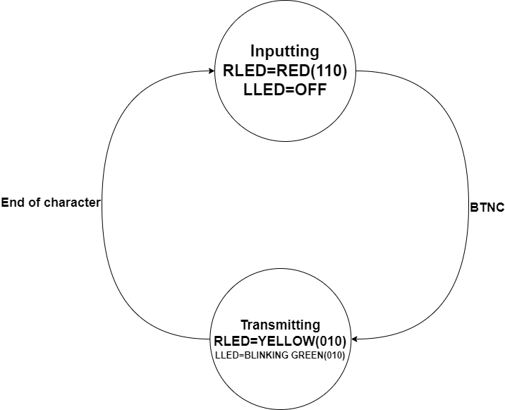

# MORSE CODE TRANSMITTER

### Team members

* Jan Pelka (responsible for xxx)
* Jakub Tauber (responsible for xxx)
* Anton Tsyhanov (responsible for xxx)
* David Hamran (responsible for display driver module, github)
### Table of contents

* [Project objectives](#objectives)
* [Hardware description](#hardware)
* [VHDL modules description and simulations](#modules)
* [TOP module description and simulations](#top)
* [Video](#video)
* [References](#references)

## Project objectives

Objective of our project is to create a Morse code transmitter. Our approach is that user will select desired character from alphabet that will be displayed on NEXYS A7-50T 7-segment displays. Transmitter will be in state of inputting, in this state a yellow LED shining. After selecting desired character, user can trasmit by pressing a button. After the press of a button state will be changed to transmitting which will be indicated by LEDs color changing to green. After trasmitting inputed character there will be a 2s pause indicatd by a red light. From this state transmitter will go back to inputting state and process can be repeated.

### State diagram:

### Alphabet represented in binary

| **Character** | **Binary** | **Character** | **Binary** | **Character** | **Binary** |
   | :-: | :-: | :-: | :-: | :-: | :-: |
   | A | 000 000 | J | 001 001 | S | 010 010 |
   | B | 000 001 | K | 001 010 | T | 010 011 |
   | C | 000 010 | L | 001 011 | U | 010 100 |
   | D | 000 011 | M | 001 100 | V | 010 101 |
   | E | 000 100 | N | 001 101 | W | 010 110 |
   | F | 000 101 | O | 001 110 | X | 010 111 |
   | G | 000 110 | P | 001 111 | Y | 011 000 |
   | H | 000 111 | Q | 010 000 | Z | 011 001 |
   | I | 001 000 | R | 010 001 | @ | 100 100 |
   
### Numbers represented in binary

| **Character** | **Binary** | **Character** | **Binary** |
   | :-: | :-: | :-: | :-: |
   | 0 | 011 010 | 5 | 011 111 |
   | 1 | 011 011 | 6 | 100 000 |
   | 2 | 011 100 | 7 | 100 001 |
   | 3 | 011 101 | 8 | 100 010 |
   | 4 | 011 110 | 9 | 100 011 |
  
### Morse alphabet

  
In addition @ symbol is represented as **.--.-.**
    

### 7-seg alphabet implementation

To display whole alphabet on 7-seg display we use 7-segment alphabet 'Seikoo' by Alexander Fakoó

Link: 
[7-segment alphabet 'Seikoo' by Alexander Fakoó in 2012](https://fakoo.de/)

## Hardware description

## VHDL modules description and simulations

### Morse display driver
This component is inspired by:[display driver](https://github.com/tomas-fryza/digital-electronics-1/tree/master/labs/07-display_driver)
First 6 7-segment displays are used to display morse code. Last display is used to display normal character or number.

### Block scheme of the driver

### Simulation
This example shows how driver displays character "a" and also demonstrates reset function.

## TOP module description and simulations

Write your text here.

## Video

Write your text here

## References

1. Write your text here.
